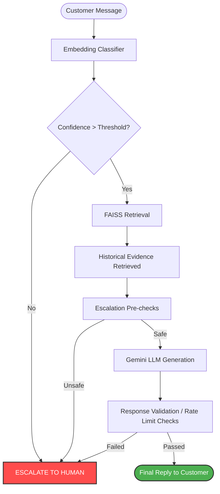

#  AppleSupport AI Agent


A robust, defense-in-depth ML pipeline for automating customer support on Twitter. Built as a production-grade, containerized AI agent.

## 🚀 Overview & Problem Statement

This project tackles the challenge of automating Twitter customer support for `AppleSupport`. The primary problem in AI customer service is balancing **Automation Rate** with **Safety**. Large Language Models (LLMs) are prone to hallucinating policies, making unauthorized refund promises, or giving dangerous technical advice when confused.

**The Solution:** This architecture wraps a generative LLM in a rigid deterministic **Escalation Engine** and grounds its responses using Retrieval-Augmented Generation (RAG) backed by a FAISS index of verified historical cases.

## ✨ Recent Updates
- **Production-Readiness**: Fully containerized with `Dockerfile` and `docker-compose.yml`. 
- **Enhanced Safety Rails**: Graceful fallback mechanisms handle API rate limits (e.g. Gemini Free-Tier) by safely self-escalating to human agents.
- **Glassmorphic UI**: A completely redesigned, Apple-esque Streamlit frontend built for high aesthetic engagement.
- **Contextual Transparency**: The UI replaces raw technical ML signals with intuitive, human-readable explanations of *why* decisions were made.

---

## 🏗 System Architecture & Workflow

The system is built with a modular architecture to ensure safety, traceability, and maintainability:

1. **`src/intent` (Classification Layer)**: Embeds incoming messages and classifies intents using a zero-shot Sentence-Transformers centroid approach (`all-MiniLM-L6-v2`).
2. **`src/retrieval` (Evidence Grounding)**: Manages a FAISS index to retrieve highly-similar, verified historical customer interactions to ground the LLM.
3. **`src/escalation` (Safety Guardrails)**: The core deterministic safety engine. It strictly enforces thresholds (e.g., low confidence, explicit human requests, high-risk financial keywords) and escalates unsafe scenarios to a human agent.
4. **`src/generation` (Response Generation)**: Interacts with the LLM (Gemini 1.5 Pro/Flash) via a structured, heavily constrained prompt injection framework.
5. **`src/pipeline.py` (Orchestration)**: Integrates the entire flow from user input to final autonomous-handle or human-escalation decisions.

### Flow Diagram



---

## 🛠 Tech Stack

- **ML & NLP**: `sentence-transformers`, `faiss-cpu`, `scikit-learn`, `numpy`, `pandas`
- **LLM Integration**: `google-generativeai` (Gemini API)
- **Backend**: `FastAPI`, `Uvicorn`
- **Frontend**: `Streamlit` (with custom glassmorphic CSS)
- **Deployment**: Docker, Docker Compose
- **Testing**: `pytest`

---

## 📦 Deployment & Setup

The system is fully containerized and production-ready.

### Prerequisites
- Docker and Docker Compose installed.
- A Gemini API Key from Google AI Studio.

### Quick Start (Docker)

1. Clone the repository:
   ```bash
   git clone https://github.com/Aryan-jaiswa/HiverAssignment.git
   cd HiverAssignment
   ```
2. Create a `.env` file from the template and add your API key:
   ```bash
   cp .env.example .env
   # Edit .env and insert GEMINI_API_KEY="your_api_key_here"
   ```
3. Spin up the cluster:
   ```bash
   docker-compose up -d --build
   ```
   - **Streamlit UI**: Available at `http://localhost:8501`
   - **FastAPI Backend**: Available at `http://localhost:8000`

### Local Development Setup
If you prefer running natively without Docker:
```bash
# 1. Install dependencies
pip install -r requirements.txt

# 2. Run the Test Suite
pytest tests/

# 3. Start the UI
streamlit run src/ui.py
```

---

## 📊 Dataset, Training & Evaluation

1. **Brand Selection**: `AppleSupport` chosen from the [Kaggle TWCS dataset](https://www.kaggle.com/datasets/thoughtvector/customer-support-on-twitter).
2. **Leakage Prevention**: Train/Test splitting strictly enforced at the **conversation level**.
3. **Intent Taxonomy**: 10-category taxonomy established for rigorous zero-shot evaluation against an isolated Golden Set.
4. **Metrics vs Reality**: We vehemently reject vanity metrics (e.g., 90% accuracy). A model scoring 90% by predicting "Troubleshooting" for everything fails catastrophically on the 2% of "Billing" complaints. See `docs/misleading_numbers.md` for a comprehensive critique.

*(Check `artifacts/evaluation/` for metric outputs generated by the evaluation suite).*
